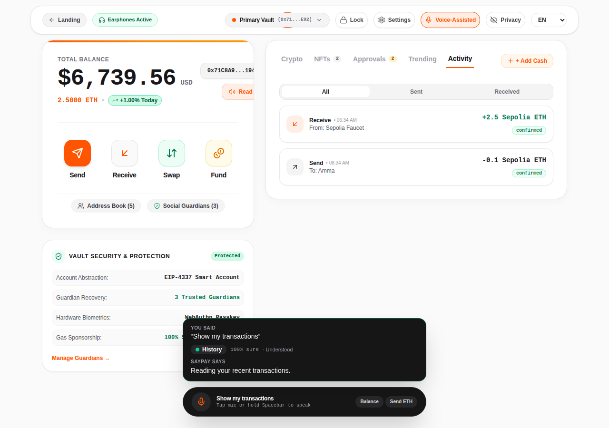

# SayPay voice model ↔ frontend: what's done and what's left

Branch: `claude/trusting-allen-e40phb` (has `main`'s frontend merged in, plus the
model in `ml/` and the contract in `contracts/`).

## Run it

```powershell
# terminal 1: the model (Python 3.11+)
cd ml
python -m venv .venv; .\.venv\Scripts\Activate.ps1; pip install -r requirements.txt   # first time
python -m uvicorn app.main:app --port 8000

# terminal 2: the frontend
cd frontend
npm install        # first time
npm run dev        # http://localhost:5173 (Chrome or Edge)
```

Open DevTools → Console: every voice command logs `[SayPay model tfidf-v3] <intent> (<confidence>)`.
If it logs `intent model unreachable`, terminal 1 isn't running and the app is
using the old keyword parser.

## How it works now

```
Space bar ─► Web Speech API (lang = page language EN / हिंदी / العربية)
          ─► handleProcessCommand(text)           FunctionalWalletPage.tsx
          ─► understandCommand(text, contacts)     src/utils/intentApi.ts
                ├─ app commands (fingerprint, earphones, contacts, guardians,
                │  settings, help, copy address, switch mode) → old intentParser.ts
                └─ money commands → POST /saypay-api/intent  (Vite forwards to :8000)
                      ↳ if no answer in 2.5 s → old intentParser.ts (fallback)
          ─► switch (result.intent) → opens the popup / speaks the reply
```

The model answers with an intent, the slots (amount, contact, …), a
`needs_clarification` flag and a `readback` sentence in the user's language
(amounts in words: "zero point zero five test ETH").

## Done ✅

| Voice command | What happens | Where |
|---|---|---|
| balance | speaks balance | `case 'check_balance'` |
| send (all details clear) | **Send popup** with contact + amount; speaks the model's read-back; "fingerprint" confirms | `case 'send'` |
| send, something missing / unsure | speaks the model's question ("How much should I send to Priya?"), **no popup** | before the `switch` |
| send in dirhams/dollars, to a phone/address, to myself | speaks why not, **no popup** | `sendBlocker()` in `intentApi.ts` |
| receive | **Receive popup** | `case 'receive'` |
| lost my phone / recovery | **Guardians popup** | model `recovery_help` → `case 'guardians'` |
| add contact | Contacts popup (name **not** filled yet, see B) | model `add_contact` → `case 'contacts'` |
| history / did my payment go through | speaks latest tx (tab **not** switched yet, see A) | `case 'history'` |
| cancel | closes all popups | `case 'cancel'` |
| not understood | "Sorry, I didn't understand. Please say it again." | before the `switch` |

Bugs fixed on the way (separate commits, please keep them):
- **abc4210** voice ran the *previous* sentence (stale React closure in `recognition.onend`) → refs.
- **42e2e64** Send popup ignored the spoken amount and sent 0.1 (`useState` initial value only) → `useEffect`.

## Left to do

Everything below is in **`docs/remaining-model-wiring.patch`** (tested: TypeScript
passes, build passes, checked in the browser). Either apply it:

```bash
cd frontend
git apply docs/remaining-model-wiring.patch
```

…or make the changes by hand as described.

### A. History → switch to the Activity tab (1 line)

`src/components/FunctionalWalletPage.tsx`, in `case 'history'`:

```tsx
case 'history': {
  if (accessibilitySettings.earconsEnabled) audioCues.playIntentRecognized();
  setActiveTab('activity'); // show the list that is being read out
  ...
```



### B. "Save this number as Ravi" → Contacts with the name filled in

1. `src/utils/intentApi.ts`, add to `interface ModelResponse`:
   ```ts
   name: string | null; // add_contact: the name to save ("save this as Ravi" -> "Ravi")
   ```
2. `src/components/ContactsModal.tsx`:
   ```tsx
   import React, { useState, useEffect } from 'react';
   // props:
   /** Voice "save this as Ravi": open the add form with this name filled in. */
   initialNewName?: string;
   // destructure `initialNewName`, then after the useState lines:
   useEffect(() => {
     if (isOpen && initialNewName) {
       setShowAddForm(true);
       setNewName(initialNewName);
     }
   }, [isOpen, initialNewName]);
   ```
3. `FunctionalWalletPage.tsx`:
   ```tsx
   const [contactPreFill, setContactPreFill] = useState<string | undefined>(undefined);

   case 'contacts': {
     if (accessibilitySettings.earconsEnabled) audioCues.playIntentRecognized();
     if (result.source === 'model' && result.model?.intent === 'add_contact') {
       setContactPreFill(result.model.name ?? undefined);
       setIsContactsOpen(true);
       speakAndFollowUp(result.readback || 'Who should I save? Say their name.', detected);
       break;
     }
     setContactPreFill(undefined);
     ...existing code...

   <ContactsModal
     isOpen={isContactsOpen}
     initialNewName={contactPreFill}
     onClose={() => { setIsContactsOpen(false); setContactPreFill(undefined); }}
     ...
   ```

### C. Voice result card above the voice bar (new)

A card that floats above the black voice capsule:
- while listening: **"Listening…"** + the live words
- after: **You said** → **understood as** (intent chip + "% sure") → **SayPay says**
- colour: green = understood, amber = needs a detail, red = not allowed,
  grey = basic parser (model offline); hides after 9 s

It is `aria-hidden`: the same reply is already spoken and announced, so a screen
reader would otherwise read it twice. It's for sighted judges/demo viewers.


1. New file `src/components/VoiceResultCard.tsx` (full code in the patch).
2. `FunctionalWalletPage.tsx`:
   ```tsx
   import { VoiceResultCard, VoiceCard } from './VoiceResultCard';

   const [voiceCard, setVoiceCard] = useState<VoiceCard | null>(null);

   // auto-hide
   useEffect(() => {
     if (!voiceCard) return;
     const t = setTimeout(() => setVoiceCard(null), 9000);
     return () => clearTimeout(t);
   }, [voiceCard]);

   // in handleProcessCommand, right after `const detected = ...; setLang(...)`:
   const blockedSend = result.intent === 'send' ? sendBlocker(result) : null;
   setVoiceCard({
     heard: spokenText,
     intent: result.model?.intent ?? result.intent,
     confidence: result.confidence,
     reply: blockedSend ?? result.readback ?? '',
     status:
       result.source !== 'model' ? 'fallback'
       : result.needsClarification ? 'ask'
       : blockedSend ? 'blocked'
       : 'ok',
     lang: detected,
   });
   ```
3. In the floating voice capsule wrapper, stack the card on top:
   ```tsx
   <div className="fixed bottom-6 inset-x-0 z-40 flex flex-col items-center px-4 pointer-events-none">
     <VoiceResultCard card={voiceCard} listening={isListening} transcript={transcript} />
     <div className="pointer-events-auto max-w-lg w-full bg-zinc-950/95 ...">  {/* existing capsule */}
   ```

### Not built (ideas, optional)
- **Request money** ("ask Priya for 20 dollars"): the model returns `receive` with
  `contact` + `amount`; the app only shows the receive QR. A "payment request" screen
  would use them.
- **Transfer status for a specific payment**: the model returns `tx_ref`
  (`{ordinal: "last", when: "yesterday", contact: "Priya"}`); history could filter by it.
- **Other currencies**: the model returns `unit` (AED, SAR, USD, INR); converting to
  ETH at a demo rate would allow "send 50 dirhams".

## Rules, please keep these

- **Never open Send when `needs_clarification` is true.** Ask the model's question.
- **Don't add default amounts/contacts** (the old `|| 0.1`, `|| 'Priya'`): a blind
  user can't see a wrong prefill.
- Keep the **fallback** to `intentParser.ts` so the demo works if the model is down.
- The language buttons (EN / हिंदी / العربية) set the speech-recognition language:
  pick Hindi/Arabic **before** speaking it.

## Quick test after changes

| Say | Expect |
|---|---|
| Send 0.05 ETH to Priya → "fingerprint" | Send popup Priya 0.05; payment of **0.05** |
| Send money to Priya | asks "How much…", no popup, amber card |
| Send 50 dirhams to Priya | "I can only send test ETH…", red card |
| Show my transactions | **Activity tab**, green card |
| Save this number as Ravi | Contacts add form with **Ravi** |
| حول 0.1 إيثيريوم لأمي (Arabic selected) | Send popup Amma 0.1, Arabic read-back |
| प्रिया को 0.2 ईथर भेजो (Hindi selected) | Send popup Priya 0.2, Hindi read-back |
| stop the model, say "What's my balance" | still answers; grey "basic parser" card |

## Model response (POST /intent)

```json
{
  "intent": "send", "confidence": 0.999, "needs_clarification": false,
  "clarification": null,               // or {"type": "missing", "slots": ["amount"]}
  "amount": 0.05, "unit": "ETH", "unit_assumed": false,
  "recipient": {"type": "contact", "value": "Priya", "contact": "Priya", "score": 1.0},
  "contact": "Priya", "name": null, "tx_ref": null,
  "lang_mix": ["en"],
  "readback": {"text": "Send zero point zero five test ETH to Priya. Confirm with your fingerprint.", "lang": "en"},
  "engine": "tfidf-v3"
}
```

Intents: `check_balance, send, receive, history, tx_status, add_contact, recovery_help, cancel, unknown`.
Full API docs while the model runs: http://localhost:8000/docs
